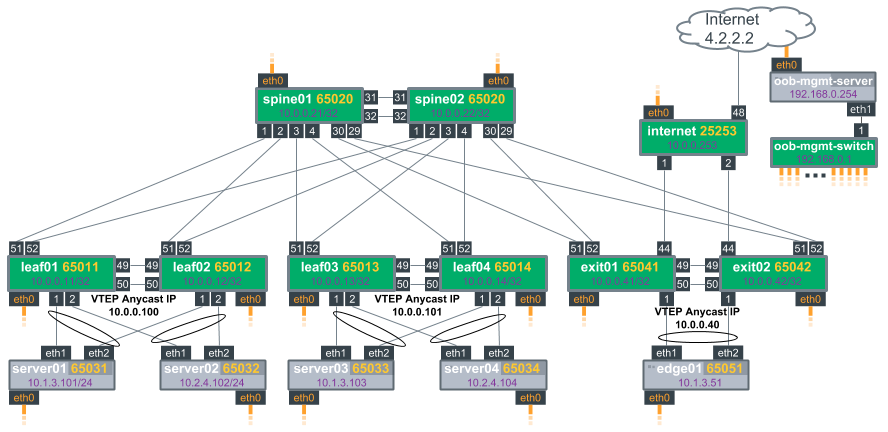

# Cumulus Linux LNV to EVPN Migration Demo


Welcome to the Cumulus Linux LNV to EVPN Migration demo. Using the [Cumulus reference topology](https://github.com/CumulusNetworks/cldemo-vagrant), this demo will walk through the steps to migrate your LNV controlled VXLAN to the de facto standard using BGP EVPN.  LNV (the vxfld package) will be depricated in Cumulus Linux 4.x in favor of using EVPN to manage VXLAN overlays.

This demo will start you with an LNV controlled VXLAN topology, then step through the process of converting to EVPN using BGP. One way will be through using ad-hoc ansible commands and NCLU.  The other way will be through an Ansible playbook that directly changes the config files and restarts the associated services.  Below are a few additional notes and details of this topology:

1. Using a [centralized routing](https://cumulusnetworks.com/blog/vxlan-designs-part-1/) model. Routing between VXLANs is done at the exit leafs.  The leaf switches exit01 and exit02 have the SVIs and provide the first hop redundancy.
2. VXLAN is in active-active mode on the MLAG enabled leafs.  The leaf switches are in pairs to provide an MLAG bond to the servers (simulating a rack).  Inbound VXLAN traffic from the rest of the fabric to the pair is addressed to the clagd-vxlan-anycast-ip IP address.  We'll see this clagd-vxlan-anycast-ip address instead of the individual loopbacks when looking at some LNV and BGP EVPN output
3. The LNV Service Nodes (vxsnd) are running in [anycast mode](https://docs.cumulusnetworks.com/display/DOCS/Lightweight+Network+Virtualization+Overview#LightweightNetworkVirtualizationOverview-ScaleLNVbyLoadBalancingwithAnycast) on both spine01 and spine02.

Need to also link to the companion whitepaper:

For more information about the reference topology and other demos based on this topology, head on over to: https://github.com/CumulusNetworks/cldemo-vagrant

## Outline

1. Deploy the topology
2. Log into the oob-mgmt-server
3. Run Ansible playbook run_demo.yml to setup the LNV scenario
4. Inspect the LNV Environment
5. Perform the migration to BGP EVPN
6. Verification

## Deploy the Topology

After cloning (or downloading/extracting the .zip), change into the new directory named "cldemo-lnv-to-evpn." From there, bring up the oob-mgmt-server and oob-mgmt-switch first.  Brining the oob-mgmt devices up first helps make sure that the DHCP server on the oob-mgmt-server is up and reliably ready to hand out IP addresses to the rest of the network when we provision it all with the last step, 'vagrant up'

    git clone https://github.com/cumulusnetworks/cldemo-lnv-to-evpn
    cd cldemo-lnv-to-evpn
    vagrant up oob-mgmt-server oob-mgmt-switch
    vagrant up

## Logging in
Once Vagrant has finished all of its provisioning, log into the oob-mgmt-server.  We'll be able to use ansible from the oob-mgmt-server to setup the rest of the demo and be able to jump into the other nodes in the topology from here.

```
$ vagrant ssh oob-mgmt-server
                                                 _
      _______   x x x                           | |
 ._  <_______~ x X x   ___ _   _ _ __ ___  _   _| |_   _ ___
(' \  ,' || `,        / __| | | | '_ ` _ \| | | | | | | / __|
 `._:^   ||   :>     | (__| |_| | | | | | | |_| | | |_| \__ \
     ^T~~~~~~T'       \___|\__,_|_| |_| |_|\__,_|_|\__,_|___/
     ~"     ~"


############################################################################
#
#                     Out Of Band Management Station
#
############################################################################
cumulus@oob-mgmt-server:~$
```
## Setting up the demo
After logging into the oob-mgmt-server, change directories to the 'lnv-to-evpn' folder.  From there, run the ansible playbook named run_demo.yml

```
cumulus@oob-mgmt-server:~$cd lnv-to-evpn
cumulus@oob-mgmt-server:~/lnv-to-evpn$ ansible-playbook run_demo.yml 

PLAY [host] *************************************************************************************************************************************************************

TASK [Gathering Facts] **************************************************************************************************************************************************
```

This playbook will configure the baseline reference topology to what is described and illustrated at the top of this guide. 

## Checking the LNV Environment

After the 'run_demo.yml' ansible playbook completes, we will have a functioning LNV controlled VXLAN topology.  Lets run a few commands to generate some traffic and to illustrate the topology.  First, lets run a traceroute from server01 to server04 that is in the other subnet and also in the other rack.  Success here means both routing is functional bi-directionally, as is VXLAN encap/decap and bridging.  We can use ansible from the oob-mgmt-server to run this traceroute for us and return the result: 

```
cumulus@oob-mgmt-server:~$ ansible server01 -a 'traceroute -n 10.2.4.104'
server01 | SUCCESS | rc=0 >>
traceroute to 10.2.4.104 (10.2.4.104), 30 hops max, 60 byte packets
 1  10.1.3.1  2.161 ms  2.106 ms  2.071 ms
 2  10.2.4.104  6.210 ms  6.165 ms *

cumulus@oob-mgmt-server:~$
```

Next, lets confirm that LNV is running and   Again, we can use ansible to run an NCLU command on all of the network nodes at the same time.

```
cumulus@oob-mgmt-server:~/lnv-to-evpn$ ansible network -a 'net show lnv'
spine01 | SUCCESS | rc=0 >>

  LNV Role           : Service Node
  Version            : 3
  Local IP           : 10.0.0.21
  Anycast IP         : 10.0.0.200
  UDP Data Port      : 4789
  UDP Control Port   : 10001
  Service Node Peers : 10.0.0.21, 10.0.0.22

  VNI  VTEP        Ageout
  ---  ----------  ------
  13   10.0.0.100      86 <- leaf01/02
       10.0.0.100      88 <- leaf01/02
       10.0.0.101      86 <- leaf03/04
       10.0.0.101      86 <- leaf03/04
       10.0.0.40       90 <- exit01/02
       10.0.0.40       90 <- exit01/02
  24   10.0.0.100      86
       10.0.0.100      88
       10.0.0.101      86
       10.0.0.101      86
       10.0.0.40       90
       10.0.0.40       90
<snip>
```
The output from the ad hoc ansible command will be separated by host.  Look for lines similar to this, `spine01 | SUCCESS | rc=0 >>`. You should see that the spines are **LNV Role: Service Node** and leafs/exit are **LNV Role: VTEP**. Remeber that with VXLAN active-active mode (clagd-vxlan-anycast-ip) we will see each VTEP register with it's *clagd-vxlan-anycast-ip* address and not it's primary loopback address.

Lastly, lets take a look at a bridge mac address table on one of the leafs that has both VXLAN VTEPs.  Your MAC addresses may differ from this example.  Notice that the linux bridge also learns the source VTEP IP address (TunnelDest) for MAC addresses that exist behind other VTEPs. 

```
cumulus@oob-mgmt-server:~/lnv-to-evpn$ ansible leaf01 -a 'net show bridge macs'
leaf01 | SUCCESS | rc=0 >>

VLAN      Master  Interface  MAC                TunnelDest  State      Flags  LastSeen
--------  ------  ---------  -----------------  ----------  ---------  -----  --------
13        bridge  bond01     00:03:00:11:11:02                                00:00:36
13        bridge  bond01     02:03:00:11:11:01                                00:00:07
13        bridge  bond01     02:03:00:11:11:02                                00:01:46
13        bridge  vni-13     44:38:39:00:00:0c                                00:01:46
13        bridge  vni-13     44:38:39:00:00:4b                                00:01:46
13        bridge  vni-13     44:39:39:ff:00:13                                00:01:46
24        bridge  bond02     02:03:00:22:22:01                                00:00:07
24        bridge  bond02     02:03:00:22:22:02                                00:01:46
24        bridge  vni-24     00:03:00:44:44:02                                00:09:03
24        bridge  vni-24     44:38:39:00:00:0c                                00:01:46
24        bridge  vni-24     44:38:39:00:00:4b                                00:01:46
24        bridge  vni-24     44:39:39:ff:00:24                                00:01:46
untagged          vni-13     00:00:00:00:00:00  10.0.0.40   permanent  self   00:10:48 <- BUM traffic handling
untagged          vni-13     00:00:00:00:00:00  10.0.0.101  permanent  self   00:10:48 <- BUM traffic handling
untagged          vni-13     44:38:39:00:00:0c  10.0.0.40              self   00:09:02 <- Learned VXLAN MAC address
untagged          vni-13     44:38:39:00:00:4b  10.0.0.40              self   00:09:02 <- Learned VXLAN MAC address
untagged          vni-13     44:39:39:ff:00:13  10.0.0.40              self   00:10:03 <- Learned VXLAN MAC address
untagged          vni-24     00:00:00:00:00:00  10.0.0.40   permanent  self   00:10:48 <- BUM traffic handling
untagged          vni-24     00:00:00:00:00:00  10.0.0.101  permanent  self   00:10:48 <- BUM traffic handling
untagged          vni-24     00:03:00:44:44:02  10.0.0.101             self   00:09:03 <- Learned VXLAN MAC address
untagged          vni-24     44:38:39:00:00:0c  10.0.0.40              self   00:09:02 <- Learned VXLAN MAC address
untagged          vni-24     44:38:39:00:00:4b  10.0.0.40              self   00:09:02 <- Learned VXLAN MAC address
untagged          vni-24     44:39:39:ff:00:24  10.0.0.40              self   00:09:30 <- Learned VXLAN MAC address
untagged  bridge  bond01     44:38:39:00:00:03              permanent         00:10:51
untagged  bridge  bond02     44:38:39:00:00:14              permanent         00:10:51
untagged  bridge  peerlink   44:38:39:00:00:10              permanent         00:10:51
untagged  bridge  vni-13     9e:32:c5:25:6b:84              permanent         00:10:51
untagged  bridge  vni-24     6e:76:b8:14:da:2b              permanent         00:10:51

cumulus@oob-mgmt-server:~/lnv-to-evpn$ 
```

## Performing the migration

We'll perform this upgrade step by step using NCLU and ad hoc ansible commands.  We have already defined a set of useful device groups in the ansible hosts file.  We have some divergence in the configuration tasks between the LNV VTEP clients (leaf/exit) and the LNV Service nodes (spine) then also the exit nodes where we perform all routing.  In this method of procedure, we'll want to have three different groups of hosts defined in /etc/ansible/hosts to make the work as quick and efficient as possible.

vtep - leaf01, leaf02, leaf03, leaf04, exit01, exit02<br>
spine - spine01, spine02<br>
exit - exit01, exit02

### 1. First we'll deploy the necessary BGP configuration.  This will start with activating the l2vpn evpn address family for all of our existing neighbors.  We have to enable this everwhere we had LNV running so this will mean the leafs, spines, and exit(routing) nodes.  The spines will learn the EVPN Type-2 and Type-3 routes from the leafs, and then distribute the routes to the other EVPN enabled neighbors.  This is two short steps. One, activate the l2vpn evpn address family for each/all neighbors. Then, enable advertise-all-vni.

Remember, these NCLU changes won't take effect until we issue the 'net commit' at a later step.

*Note: Repetitive output will be omitted for brevity and indicated by `<snip>`*

```
cumulus@oob-mgmt-server:~/lnv-to-evpn$ ansible vtep -a 'net add bgp l2vpn evpn neighbor swp51-52 activate'
leaf02 | SUCCESS | rc=0 >>


exit01 | SUCCESS | rc=0 >>

<snip>

cumulus@oob-mgmt-server:~/lnv-to-evpn$
cumulus@oob-mgmt-server:~/lnv-to-evpn$ ansible vtep -a 'net add bgp l2vpn evpn advertise-all-vni'
leaf02 | SUCCESS | rc=0 >>


exit01 | SUCCESS | rc=0 >>


<snip>
cumulus@oob-mgmt-server:~$ 
```

- We have repeat these steps for the spines.  The configuration is slightly different here.  Ports 1-4 on the spines connect to leaf01-04.  Ports 29-30 connect to exit01 and exit02.

```
cumulus@oob-mgmt-server:~/lnv-to-evpn$ ansible spine -a 'net add bgp l2vpn evpn neighbor swp1-4 activate'
spine01 | SUCCESS | rc=0 >>


spine02 | SUCCESS | rc=0 >>


cumulus@oob-mgmt-server:~/lnv-to-evpn$ ansible spine -a 'net add bgp l2vpn evpn neighbor swp29-30 activate'
spine02 | SUCCESS | rc=0 >>


spine01 | SUCCESS | rc=0 >>


cumulus@oob-mgmt-server:~/lnv-to-evpn$
```

- We also have a situation unique to the exit leafs performing routing. For [centralized routing](https://docs.cumulusnetworks.com/display/DOCS/Ethernet+Virtual+Private+Network+-+EVPN#EthernetVirtualPrivateNetwork-EVPN-centralizedCentralizedRouting) we must also configure `advertise-default-gw` for the l2vpn evpn address family on those nodes.  This ensures that the exit/routing nodes advertise the SVI   So for exit01 and exit02, we'll need to:

```
cumulus@oob-mgmt-server:~/lnv-to-evpn$ ansible exit -a 'net add bgp l2vpn evpn advertise-default-gw'
exit01 | SUCCESS | rc=0 >>

exit02 | SUCCESS | rc=0 >>


cumulus@oob-mgmt-server:~/lnv-to-evpn$ 
```

### 2. Then disable bridge learning on all of the VXLAN VTEP interfaces (leafs/exit):

```
cumulus@oob-mgmt-server:~/lnv-to-evpn$ ansible vtep -a 'net add vxlan vni-13 bridge learning off'
exit01 | SUCCESS | rc=0 >>


leaf01 | SUCCESS | rc=0 >>

<snip>

cumulus@oob-mgmt-server:~/lnv-to-evpn$ ansible vtep -a 'net add vxlan vni-24 bridge learning off'
leaf03 | SUCCESS | rc=0 >>


leaf01 | SUCCESS | rc=0 >>

<snip>

cumulus@oob-mgmt-server:~/lnv-to-evpn$ 
```

### 3. Next, remove the vxrd configuration from the loopback interfaces of VTEP nodes (leaf/exit). This includes removing the vxrd-src-ip and vxrd-svcnode-ip configuration.

```
cumulus@oob-mgmt-server:~$ ansible vtep -a 'net del loopback lo vxrd-src-ip'
leaf02 | SUCCESS | rc=0 >>


leaf01 | SUCCESS | rc=0 >>

<snip>


cumulus@oob-mgmt-server:~$ ansible vtep -a 'net del loopback lo vxrd-svcnode-ip'
leaf02 | SUCCESS | rc=0 >>


leaf04 | SUCCESS | rc=0 >>

<snip>

cumulus@oob-mgmt-server:~$ 

```

### 4. Prior to issuing a 'net commit' and applying these changes, we need to disable and stop the LNV service on all of the nodes where it is enabled.  This means we need to stop both the vxrd and vxsnd services and then also disable them so that they do not attempt to start again automatically.

Notice, we need *--become* for these commands

```
cumulus@oob-mgmt-server:~/lnv-to-evpn$ ansible spine -a 'systemctl stop vxsnd.service' --become
spine01 | SUCCESS | rc=0 >>


spine02 | SUCCESS | rc=0 >>


cumulus@oob-mgmt-server:~/lnv-to-evpn$ ansible spine -a 'systemctl disable vxsnd.service' --become
spine01 | SUCCESS | rc=0 >>
Removed symlink /etc/systemd/system/basic.target.wants/vxsnd.service.

spine02 | SUCCESS | rc=0 >>
Removed symlink /etc/systemd/system/basic.target.wants/vxsnd.service.

cumulus@oob-mgmt-server:~/lnv-to-evpn$ 
```

Repeat these two 'stop' and 'disable' steps on the VTEP nodes (leaf/exit), the difference being that it is the *vxrd* here.

```
cumulus@oob-mgmt-server:~/lnv-to-evpn$ ansible vtep -a 'systemctl stop vxrd.service' --become
leaf01 | SUCCESS | rc=0 >>


leaf02 | SUCCESS | rc=0 >>

<snip>

cumulus@oob-mgmt-server:~/lnv-to-evpn$ ansible vtep -a 'systemctl disable vxrd.service' --become
leaf01 | SUCCESS | rc=0 >>
Removed symlink /etc/systemd/system/basic.target.wants/vxrd.service.

exit01 | SUCCESS | rc=0 >>
Removed symlink /etc/systemd/system/basic.target.wants/vxrd.service.

<snip>

cumulus@oob-mgmt-server:~/lnv-to-evpn$ 
```

### 5. Commit the changes

```
cumulus@oob-mgmt-server:~/lnv-to-evpn$ ansible network -a 'net commit'
```

This commit will return a fairly significant amount of output from each node returning the diff of the config files where the NCLU changes are being applied.  NCLU is also restarting services and applying interface changes as necessary.

This is the moment where BGP will restart and interfaces will be reloaded to apply configuration changes (specifically the bridge learning change).  

## Verification

### 1. Check that LNV is disabled.  'net show lnv' should return blank output.  Compare this output against the output from earlier on when LNV was enabled and functional.

```
cumulus@oob-mgmt-server:~/lnv-to-evpn$ ansible network -a 'net show lnv'
leaf03 | SUCCESS | rc=0 >>


spine01 | SUCCESS | rc=0 >>


leaf02 | SUCCESS | rc=0 >>


leaf04 | SUCCESS | rc=0 >>


spine02 | SUCCESS | rc=0 >>


leaf01 | SUCCESS | rc=0 >>


internet | SUCCESS | rc=0 >>


exit01 | SUCCESS | rc=0 >>


exit02 | SUCCESS | rc=0 >>


cumulus@oob-mgmt-server:~/lnv-to-evpn$ 
```

### 2. Ensure that BGP neighbors are up and both ipv4 and l2vpn EVPN address families are active.  You can continue to run these commands on all network nodes using ansible or individually on a node.

```
cumulus@oob-mgmt-server:~/lnv-to-evpn$ ansible network -a 'net show bgp sum'
spine01 | SUCCESS | rc=0 >>

show bgp ipv4 unicast summary <- ipv4 unicast family
=============================
BGP router identifier 10.0.0.21, local AS number 65020 vrf-id 0
BGP table version 386
RIB entries 29, using 4408 bytes of memory
Peers 6, using 116 KiB of memory

Neighbor        V         AS MsgRcvd MsgSent   TblVer  InQ OutQ  Up/Down State/PfxRcd
leaf01(swp1)    4      65011    1053    1010        0    0    0 00:11:38           15
leaf02(swp2)    4      65012    1013    1021        0    0    0 00:11:41           15
leaf03(swp3)    4      65013    1030    1026        0    0    0 00:11:41           15
leaf04(swp4)    4      65014    1065    1035        0    0    0 00:11:41           15
exit02(swp29)   4      65042    1087    1090        0    0    0 00:11:37           15
exit01(swp30)   4      65041    1060    1049        0    0    0 00:11:38           15

Total number of neighbors 6


show bgp ipv6 unicast summary
=============================
% No BGP neighbors found


show bgp l2vpn evpn summary <- l2vpn evpn family
===========================
BGP router identifier 10.0.0.21, local AS number 65020 vrf-id 0
BGP table version 0
RIB entries 23, using 3496 bytes of memory
Peers 6, using 116 KiB of memory

Neighbor        V         AS MsgRcvd MsgSent   TblVer  InQ OutQ  Up/Down State/PfxRcd
leaf01(swp1)    4      65011    1053    1010        0    0    0 00:11:38            8
leaf02(swp2)    4      65012    1013    1021        0    0    0 00:11:41            8
leaf03(swp3)    4      65013    1030    1026        0    0    0 00:11:41            8
leaf04(swp4)    4      65014    1065    1035        0    0    0 00:11:41            8
exit02(swp29)   4      65042    1087    1090        0    0    0 00:11:37            9
exit01(swp30)   4      65041    1060    1049        0    0    0 00:11:38            9

Total number of neighbors 6

```

In this working example from looking at spine01, we can see that we have all 6 adjacent neighbors showing as up for both address families.  It's important to ensure that we're seeing a 'PfxRcd' that's larger than 0 to let us know that we're recieving routes.  This number will vary depending on the amount of mac addresses learned.

### 3. Generate Some Test Traffic

Repeat the traceroute from earlier `ansible server01 -a 'traceroute -n 10.2.4.104`.

```
cumulus@oob-mgmt-server:~$ ansible server01 -a 'traceroute -n 10.2.4.104'
server01 | SUCCESS | rc=0 >>
traceroute to 10.2.4.104 (10.2.4.104), 30 hops max, 60 byte packets
 1  10.1.3.1  6.041 ms  5.993 ms  5.958 ms
 2  10.2.4.104  12.836 ms  12.811 ms  9.030 ms

cumulus@oob-mgmt-server:~$ 
```

### 4. Check the BGP EVPN Type-2 and Type-3 routes

The traceroute above should ensure that the linux bridges have learned the MAC addresses of at least server01, server04 and the mac addresses of the SVIs performing routing at the exit nodes.  This information should be redistibuted into BGP as routes in the EVPN address family.  We can inspect these type-2 (MAC to IP) routes and type-3 (VTEP VXLAN tunnel interface IP) routes by checking 'net show bgp evpn route'

```
cumulus@leaf01:mgmt-vrf:~$ net show bgp evpn route
BGP table version is 30, local router ID is 10.0.0.11
Status codes: s suppressed, d damped, h history, * valid, > best, i - internal
Origin codes: i - IGP, e - EGP, ? - incomplete
EVPN type-2 prefix: [2]:[ESI]:[EthTag]:[MAClen]:[MAC]:[IPlen]:[IP]
EVPN type-3 prefix: [3]:[EthTag]:[IPlen]:[OrigIP]
EVPN type-5 prefix: [5]:[ESI]:[EthTag]:[IPlen]:[IP]

   Network          Next Hop            Metric LocPrf Weight Path
Route Distinguisher: 10.0.0.11:2
*> [2]:[0]:[0]:[48]:[00:03:00:11:11:02]
                    10.0.0.100                         32768 i
*> [2]:[0]:[0]:[48]:[02:03:00:11:11:01]
                    10.0.0.100                         32768 i
*> [2]:[0]:[0]:[48]:[02:03:00:11:11:02]
                    10.0.0.100                         32768 i
*> [3]:[0]:[32]:[10.0.0.100]
                    10.0.0.100                         32768 i
Route Distinguisher: 10.0.0.11:3
*> [2]:[0]:[0]:[48]:[00:03:00:22:22:01]
                    10.0.0.100                         32768 i
<snip>
```

Notice the legend at the top of the command output.  The number in the first bracket `[2]` or `[3]` indicates whether or not this is a type-2 or type-3 route.  In this output you can verify that MAC addresses of the servers or SVIs are being learned and what their VTEP VXLAN tunnel IP address is *remember clagd-vxlan-anycast-ip is used for active-active mode*

### 5. Check the Bridge Forwarding Table

After type-2 and type-3 routes are learned through BGP, this information has to then be installed into the bridge table for traffic forwarding to actually occur.  The type-2 routes contain all of the information that the linux bridge needs to install a learned mac address with its VXLAN tunnel IP adddress into the bridge table.  The type-3 routes are installed as the all 00's entry to indicate a VTEP that needs a replicated copy of a packet for BUM (broadcast unknown unicast and multicast) packet handling.

We should see the information from the BGP EVPN routes be populated as described above into the bridge table.


---

>©2018 Cumulus Networks. CUMULUS, the Cumulus Logo, CUMULUS NETWORKS, and the Rocket Turtle Logo 
(the “Marks”) are trademarks and service marks of Cumulus Networks, Inc. in the U.S. and other 
countries. You are not permitted to use the Marks without the prior written consent of Cumulus 
Networks. The registered trademark Linux® is used pursuant to a sublicense from LMI, the exclusive 
licensee of Linus Torvalds, owner of the mark on a world-wide basis. All other marks are used under 
fair use or license from their respective owners.

For further details please see: [cumulusnetworks.com](http://www.cumulusnetworks.com)
